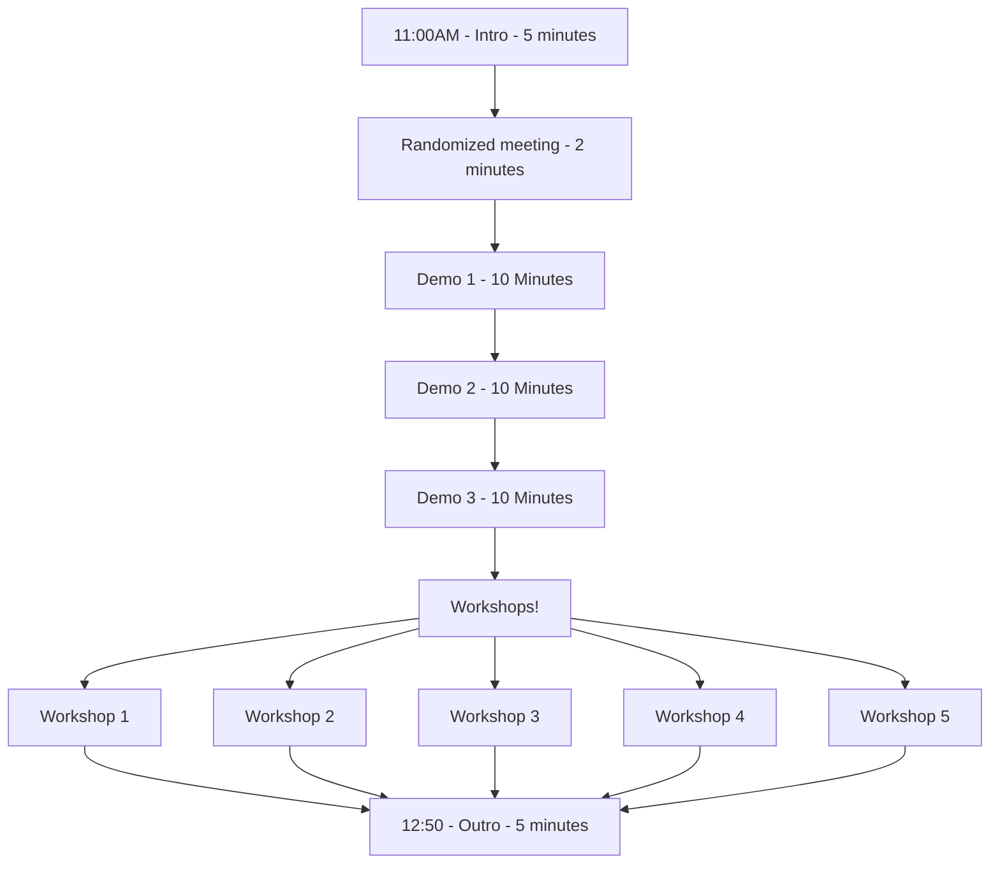

```mermaid
graph TD
    A[11:00AM - Intro - 5 minutes] --> B[Randomized meeting - 2 minutes]
    B --> C[Demo 1 - 10 Minutes]
    C --> D[Demo 2 - 10 Minutes]
    D --> E[Demo 3 - 10 Minutes]
    E --> F[Workshops!]
    
    F --> G[Workshop 1]
    F --> H[Workshop 2]
    F --> I[Workshop 3]
    F --> J[Workshop 4]
    F --> K[Workshop 5]
    
    G & H & I & J & K --> N[12:50 - Outro - 5 minutes]
```
