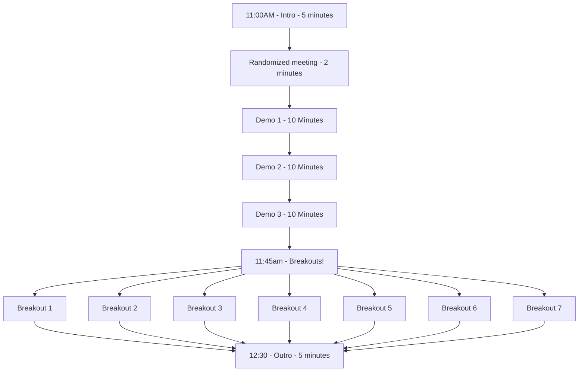

```mermaid
graph TD
    A[11:00AM - Intro - 5 minutes] --> B[Randomized meeting - 2 minutes]
    B --> C[Demo 1 - 10 Minutes]
    C --> D[Demo 2 - 10 Minutes]
    D --> E[Demo 3 - 10 Minutes]
    E --> F[11:45am - Breakouts!]
    
    F --> G[Breakout 1]
    F --> H[Breakout 2]
    F --> I[Breakout 3]
    F --> J[Breakout 4]
    F --> K[Breakout 5]
    F --> L[Breakout 6]
    F --> M[Breakout 7]
    
    G & H & I & J & K & L & M --> N[12:30 - Outro - 5 minutes]
```
